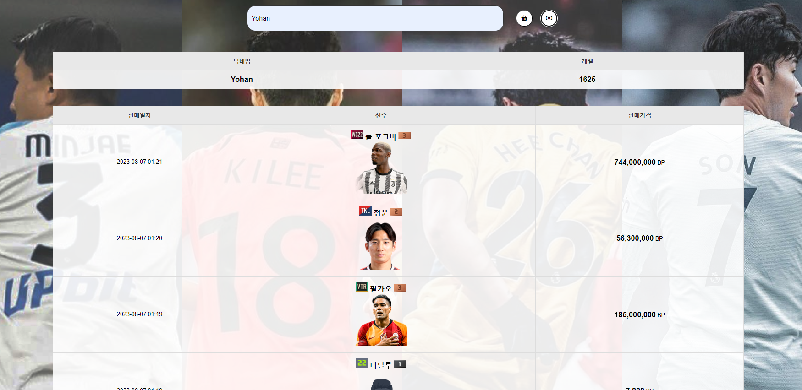

# 피파온라인 전적검색 사이트

### 개요
* **HTML**과 **JavaScript** ,**NEXON API**를 이용한 피파온라인4 전적검색 웹사이트 구현 

### 공헌한 내용
* 참여도: **개인프로젝트**
* HTML, CSS, BootStrap, JavaScript, jQuery
* Json, Nexon API
 

### **메인 화면**

 
- 메인화면에는 최근 인기가 많은 유튜브 영상을 4개 띄우도록 구현  
- 판매 금액에 대한 수수료 계산기 구현

### **전적 검색** 

 
- 전적 검색을 통해 사용자의 매치 정보를 볼 수 있게 구현
      

### **구매 목록**  

### **판매 목록**  

- 한 검색 탭에서 버튼 두 개를 통해 구매목록이나 판매목록을 볼 수 있게 구현
